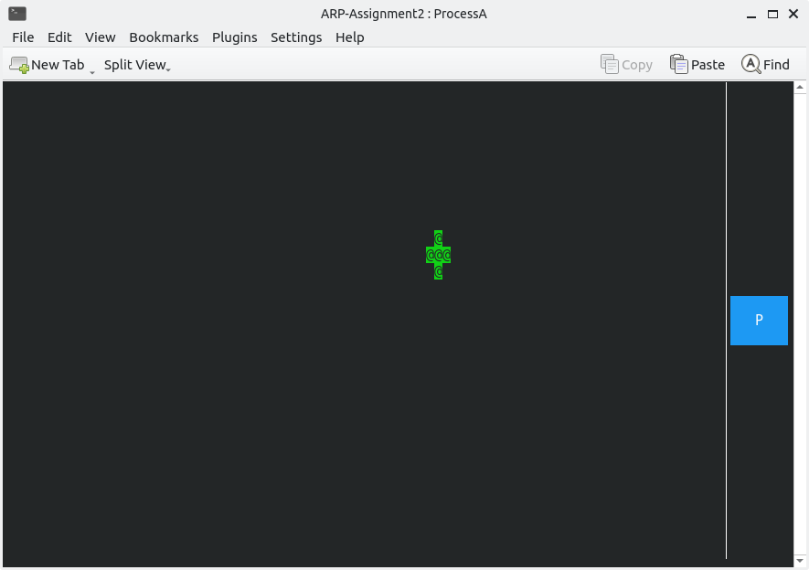
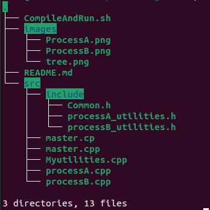

# ARP Second Assignment
Done By 
- Baba HADJ SAID ID: 5413915
- Abdelghani BAKOUR ID: 5189438
### User Manual:
This repository contains our solution to **ARP Third Assignment**, and the following is a user manual.
#### Requirements:
##### *libbitmap* installation:
To work with the bitmap library, you need to follow these steps:
1. Download the source code from [this GitHub repo](https://github.com/draekko/libbitmap.git) in your file system.
2. Navigate to the root directory of the downloaded repo and run the configuration through command ```./configure```. Configuration might take a while.  While running, it prints some messages telling which features it is checking for.
3. Type ```make``` to compile the package.
4. Run ```sudo make install``` to install the programs and any data files and documentation.
5. Upon completing the installation, check that the files have been properly installed by navigating to ```/usr/local/lib```, where you should find the ```libbmp.so``` shared library ready for use.
6. In order to properly compile programs which use the *libbitmap* library, you first need to notify the **linker** about the location of the shared library. To do that, you can simply add the following line at the end of your ```.bashrc``` file:      
```export LD_LIBRARY_PATH="/usr/local/lib:$LD_LIBRARY_PATH"```
##### *ncurses library* installation:
To install the ncurses library, simply open a terminal and type the following command:
```console
sudo apt-get install libncurses-dev
```
#### To Compile and Run the Program:
Browse to the folder containing the project Open a CMD and run the command: 
```console
chmod +x ./CompileAndRun.sh
./CompileAndRun.sh 
```
This command will set-up, Compile and Run the program.
you will then be prompt with Two konsole windows, which are as follows:
##### Process A:
Process A has been modified to include additional functionality in the form of three different modalities:
- In normal mode, Process A allows the user to visualize and move a circle on a 2-D view as described in the user manual of our [previous assignment](https://github.com/babahadjsaid/ARPSecondAssignment) by moving the circle and saving snapshots.
- In server mode, Process A actively listens for incoming commands from a client, displays the updated information on the screen and forwards it to Process B. In this mode, the screen is read-only and the user cannot interact with it, they can only exit this mode by entering 'q' and return to the main menu.
- In client mode, Process A listens to user inputs, updates the screen to provide real-time feedback, and sends the entered commands to the server. The user can exit this mode by entering 'q' and return to the main menu.<br/> 
The entire project can be quit by pressing 'ctrl+c'.<br/> 
Overall, the program has been modified to include additional functionality in the form of inter-process communication through messaging in both server and client mode, in addition to the normal mode functionality from the previous assignment.<br/><br/> 

##### Process B:
This window displays the position and the history of the circle, the history is a sliding window of the past 1000 positions the circle had gone through.


## Folders tree:


The repository is organized as follows:
- the `src` folder contains all the source code.

- the `src/include` folder contains all the header files.

After compiling the program, other two directories will be created:

- the `bin` folder contains all the executable files
- the `Logs` folder will contain all the log files.
## Processes
The project is composed of 3 processes:
- `master.cpp` is the first process to be executed and it takes care of launching all the other processes. In case one of them terminates unexpectedly it prints the status to the screen, when ctrl+c is pressed the master process will kill all the processes and terminate.
- `ProcessA.cpp` The process operates in three distinct modes, the normal and server modes implement communication through shared memory, using semaphores to synchronize access and prevent race conditions. Meanwhile, communication between server and client modes is achieved through socket connection.
- `ProcessB.cpp` reads the shared memory and extract the bit map, then it calculates the current position of the circle and saves it in a history array.

## Other Files:
- `Myutilities.cpp` contains all the functions that are common to all processes in one place, to simplify the reading process of the code, and as a way to create an abstraction.
- `mu.h` a header file contains all that is needed for the code to run (the imports,global variables,MACROS,...).
